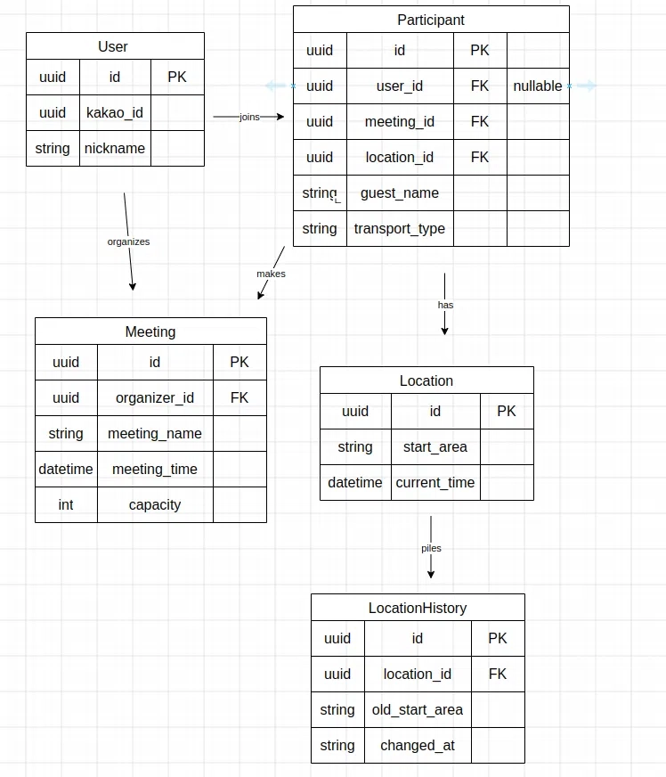

# 우리사이 (BetweenUs)

> 서로 다른 지역에 사는 사람들끼리 약속을 잡을 때, 각자의 출발지를 기준으로 공정한 중간지점과 근처 만남 장소를 찾아주는 앱


## 목차

- [프로젝트 소개](#프로젝트-소개)
- [핵심 기능](#핵심-기능)
- [기술 스택](#기술-스택)
- [아키텍처](#아키텍처)
- [기술 선택 이유](#기술-선택-이유)
- [ERD](#erd)
- [API 명세](#api-명세)
- [트러블슈팅](#트러블슈팅)
- [실행 방법](#실행-방법)
- [향후 개선 계획](#향후-개선-계획)

## 프로젝트 소개

같은 학교나 회사처럼 활동 반경이 겹치는 사람들과의 약속은 장소를 정하기 어렵지 않지만, 오랜만에 만나는 친구나 다른 지역에 사는 지인과 약속을 잡을 때는 어디서 만나야 할지 고민하게 됩니다. 지도상 중간지점이라 해도 실제 대중교통 이동 시간은 참여자마다 크게 차이가 나는 경우가 많아, 한쪽이 유독 오래 걸리면 부담을 느끼고 약속이 취소되는 경우도 있습니다.

**우리사이**는 참여자들의 출발지를 입력받아 지리적 중간지점을 계산하고, 그 주변의 실제 갈만한 장소까지 함께 보여주는 서비스입니다.

## 핵심 기능

- 📍 **출발지 검색 및 등록**: 카카오맵 API를 활용한 주소/장소명 검색
- 📐 **중간지점 계산**: 여러 참여자의 출발지 좌표를 기반으로 지리적 중간점 산출
- 🗺️ **지도 시각화**: 계산된 중간지점을 지도 위에 표시

## 기술 스택

| 영역 | 기술 |
|---|---|
| 프론트엔드 | React Native (Expo, TypeScript) |
| 백엔드 | Node.js, Express |
| ORM | Prisma |
| 데이터베이스 | PostgreSQL (Neon) |
| 외부 API | 카카오맵 API (키워드 검색) |
| 지도 | react-native-maps |
| 배포/인프라 | Git, GitHub |

## 아키텍처

```
┌─────────────────┐         ┌──────────────────┐         ┌──────────────┐
│  React Native    │  HTTP   │  Express Server   │  Prisma │  PostgreSQL  │
│  (Expo)          │ ──────> │  (REST API)        │ ──────> │  (Neon)      │
└─────────────────┘         └──────────────────┘         └──────────────┘
                                      │
                                      │ REST API
                                      ▼
                              ┌──────────────────┐
                              │  카카오맵 API      │
                              │  (키워드 검색)      │
                              └──────────────────┘
```

## 기술 선택 이유

**React Native (Expo)**
JS/TS 하나로 프론트엔드 전체를 다룰 수 있어 첫 모바일 프로젝트의 학습 곡선을 낮추기 위해 선택했습니다. Expo의 Go 앱을 이용하면 네이티브 빌드 없이 실시간으로 기기에서 결과를 확인할 수 있어 개발 속도가 빠릅니다.

**Express**
Nest.js 대비 강제되는 구조가 적어 자유도가 높고, 배워야 할 개념(모듈, 데코레이터, DI 등)이 적어 백엔드가 처음인 상황에서 빠르게 완주 경험을 쌓기에 적합하다고 판단했습니다.

**Prisma + PostgreSQL (Neon)**
관계형 데이터(사용자-모임-참여자-출발지)를 다루기에 PostgreSQL이 적합했고, 클라우드 DB(Neon)를 사용해 로컬 설치 트러블슈팅 없이 바로 개발과 배포 환경을 통일할 수 있었습니다. Prisma는 SQL 없이 타입 안정성 있는 코드로 DB를 다룰 수 있어 채택했습니다.

## ERD

주요 테이블: `User`, `Meeting`, `Participant`, `Location`, `LocationHistory`

- `User`와 `Meeting`은 다대다 관계이므로 `Participant`를 중간 테이블로 두어 관계를 표현했습니다.
- 게스트(비로그인) 참여를 지원하기 위해 `Participant.userId`를 nullable로 설계했습니다.
- 출발지는 유저가 아닌 `Participant`에 종속시켜, 동일 인물이 여러 모임에서 서로 다른 출발지를 가질 수 있도록 했습니다.
- 좌표 변경 이력 추적을 위해 `Location`(현재값)과 `LocationHistory`(변경 이력)를 분리했습니다.



## API 명세

| Method | Endpoint | 설명 |
|---|---|---|
| POST | `/meetings` | 모임 생성 |
| GET | `/meetings/:id` | 모임 조회 |
| POST | `/meetings/:id/participants` | 참가자 추가 |
| GET | `/meetings/:id/participants` | 참가자 목록 조회 |
| POST | `/participants/:id/location` | 출발지 저장 |
| GET | `/participants/:id/location` | 출발지 조회 |
| GET | `/search/address?query=` | 주소/장소명 검색 (카카오 키워드 검색) |
| GET | `/meetings/:id/midpoint` | 중간지점 계산 |

## 트러블슈팅

### 1. Prisma 7 버전 구조 변경으로 인한 연쇄 이슈

가장 오래 걸린 문제였습니다. 최근 출시된 Prisma 7을 사용하며 기존 문서와 다르게 동작하는 부분이 많았습니다.

- **증상 1**: `PrismaClient is not a constructor` — 최신 `provider`(`prisma-client`)가 TypeScript 전용 파일만 생성해, 순수 JS 프로젝트에서 `require`가 동작하지 않음
  → `provider`를 `prisma-client-js`로 변경해 해결
- **증상 2**: `PrismaClient was instantiated without any options` — Prisma 7부터 DB 연결 시 드라이버 어댑터를 명시적으로 지정해야 함
  → `@prisma/adapter-pg`를 설치하고 `PrismaPg` 어댑터를 `PrismaClient`에 전달해 해결

공식 문서와 GitHub 이슈를 검색하며 버전 변경사항을 하나씩 원인으로 좁혀갔습니다.

### 2. Expo SDK 버전 불일치로 인한 연쇄 에러

프로젝트를 최신 Expo SDK로 생성했으나, 당시 App Store 심사 지연으로 배포된 Expo Go 앱이 구버전 SDK까지만 지원하는 상황이었습니다.

- SDK를 다운그레이드하는 과정에서 관련 패키지들의 peer dependency가 충돌해 `npm install --legacy-peer-deps`로 해결
- 다운그레이드 이후 일부 컴포넌트(`expo-router/unstable-native-tabs` 등 실험적 기능)가 깨지며 `Element type is invalid` 렌더링 에러 발생
  → 문제 범위를 좁히기 위해 레이아웃을 최소 단위(`Stack`)로 단순화해 원인이 되는 컴포넌트를 특정하고 제거

### 3. 프론트-백엔드 연동 시 발생한 이슈

- **네트워크**: 로컬 개발 환경에서 실기기가 `localhost` 대신 컴퓨터의 네트워크 IP로 접근해야 한다는 점을 파악. IP가 자주 바뀌어 매번 여러 파일을 수정해야 했던 문제를, `config.ts` 파일 하나로 API 주소를 중앙 관리하도록 리팩토링해 해결
- **누락된 API**: 기획 단계에서 설계했던 주소 검색 API(`/search/address`)를 실제 구현에서 누락한 채 프론트엔드 개발을 진행해, 연동 테스트 중 `Network request timed out`/`JSON Parse error`로 발견 → 각 API 호출 단계에 로그를 추가해 실패 지점을 좁혀가며 원인을 특정

## 실행 방법

### 백엔드

```bash
cd backend
npm install
# .env 파일에 DATABASE_URL, KAKAO_API_KEY 설정
npx prisma generate
npx prisma migrate dev
npm run dev
```

### 프론트엔드

```bash
cd frontend
npm install
# src/config.ts에 백엔드 서버의 네트워크 IP 주소 입력
npx expo start
```

Expo Go 앱으로 QR코드를 스캔하여 실행합니다.

## 향후 개선 계획

- 카카오 로그인 및 친구 초대 기능
- 2:1 가중치를 반영한 중간지점 계산 (참여자 간 거리 편차 보정)
- 중간지점 근처 추천 장소(맛집/카페) 표시
- 계절/시간대별 맞춤 장소 추천
- 실시간 위치 공유 및 출발 알림